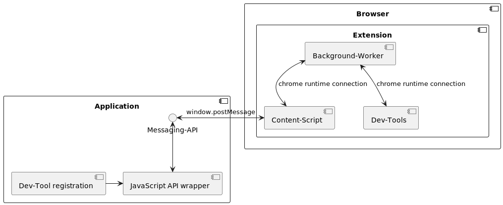

Proof of Concept - Generic dev tools
===

> :warning: DISCLAIMER: This is a very minimal proof of concept, with **no error handling or tests** at all.
> 
> It is a pure evaluation for now. Feel free to reuse this work for other projects.

This repository contains a proof of concept for registering devtools directly from the running application in the
browser.

## Background

Especially in larger applications or enterprise web applications tests and development requires adjusting values or
mocking states to show it to stakeholders.

In some cases the framework tools provided are enough, but a bit cumbersome to use. Some developers start to write their
own dev tools. Most of the time containing some kind of page overlay, setting query parameters to toggle specific
behaviour. Sometimes even providing step-by-step documentation using the framework provided dev tools.

## Motivation

As mentioned in background there are many way to handle this: but all require some effort that is not always
reasonable. The goal is to provide a really slim API exposing a way to register custom features inside the browser
builtin dev tools.

## Implementation

### Application

- Contains small JavaScript API wrapper around window messaging
- Talks with content script via window messaging

### Extension

- Content script
    - Injected into application page setting up a connection between the page and the extension itself
    - Running in same context as application
- Background worker is required to make communication between content script and dev tools work
    - Takes care of routing messages to chrome runtime or window depending on direction
- Dev-Tools
    - When opened send an event to content script telling they have been opened
    - Communicate only via events with the application (technical limitation)
    - Renders devtools based on elements getting registered by application

## Current limitations

- Only supports buttons and basic inputs for now
- No complex structure for layout (yet)

## What is missing for real world usage

- Add stable API interface with typing
- Add error handling
- Support more complex layouts and more UI elements
- Provide instructions on how to use in applications
  - only include devtools in dev builds etc.
- Creating extension for other browsers (moving out the reusable parts for other browsers)
- Publishing npm package for API

## Try out

### Requirements
- Chrome

## Instructions
- Set up extension folder as unbundled Chrome extension
  - Got to _Extensions_
  - Toggle developer mode
  - Click _Load unpacked_
  - Select `./extension`
- Open `application/index.html` in your browser (preferably with local web server)
- Open dev tools and go to tab _Custom Dev tools_
- Now you can interact with the page using the few actions that got registered by the application
