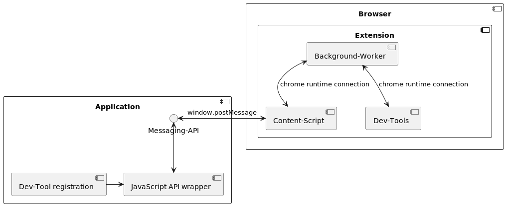
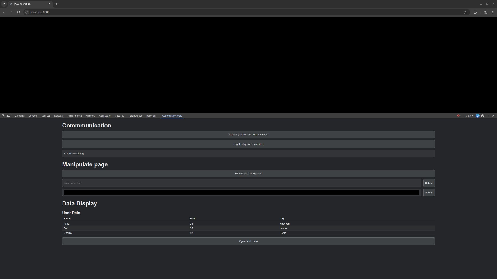
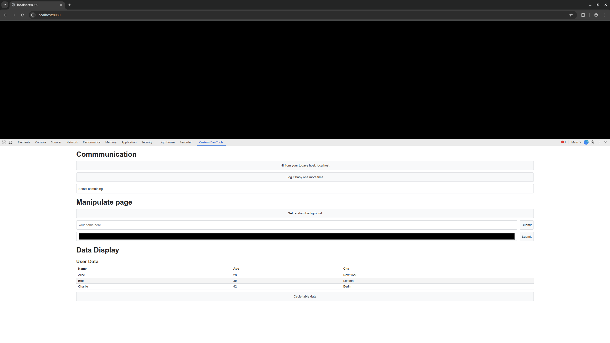
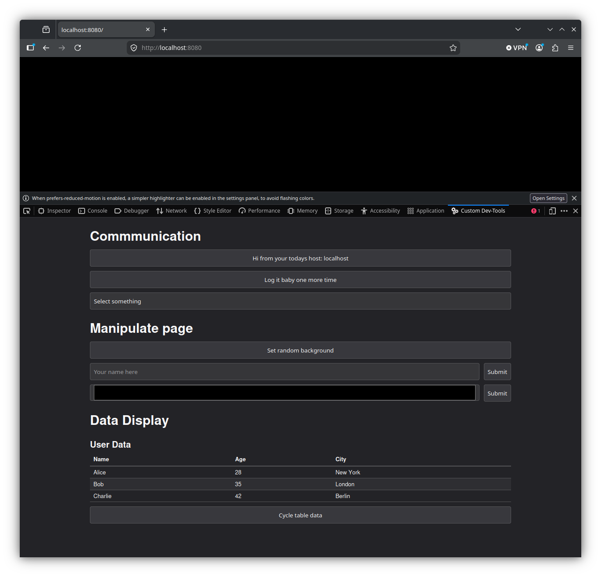
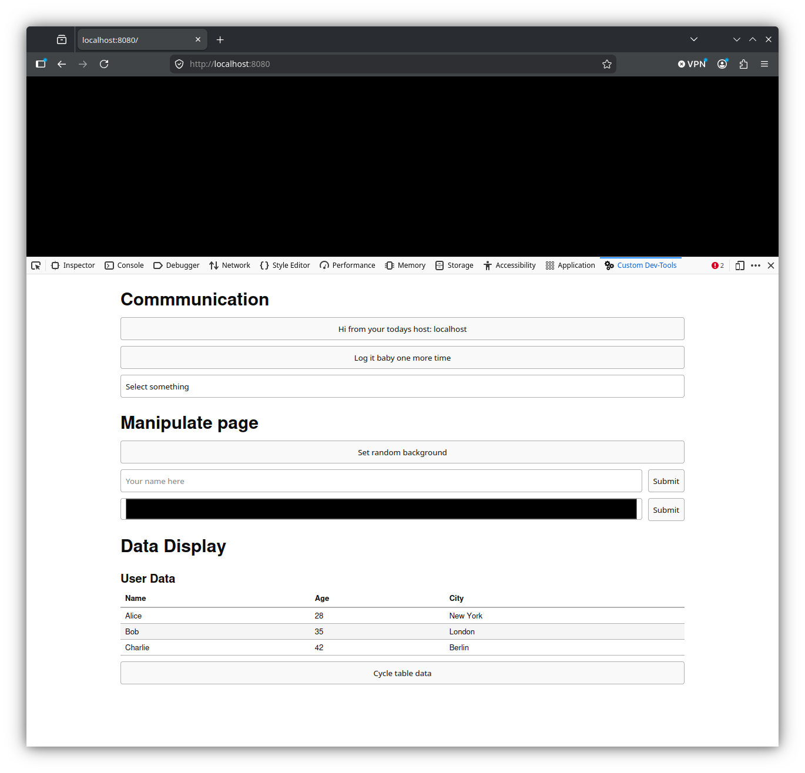

Proof of Concept - Generic dev tools
===

> :warning: DISCLAIMER: This is a very minimal proof of concept, with **no error handling or tests** at all.
> 
> It is a pure evaluation for now. Feel free to reuse this work for other projects.

This repository contains a proof of concept for registering devtools directly from the running application in the
browser.

## Background

Especially in larger applications or enterprise web applications tests and development requires adjusting values or
mocking states to show it to stakeholders.

In some cases the framework tools provided are enough, but a bit cumbersome to use. Some developers start to write their
own dev tools. Most of the time containing some kind of page overlay, setting query parameters to toggle specific
behaviour. Sometimes even providing step-by-step documentation using the framework provided dev tools.

## Motivation

As mentioned in background there are many way to handle this: but all require some effort that is not always
reasonable. The goal is to provide a really slim API exposing a way to register custom features inside the browser
builtin dev tools.

## Implementation



### Application

- Contains small JavaScript API wrapper around window messaging
- Talks with content script via window messaging

### Extension

- Content script
    - Injected into application page setting up a connection between the page and the extension itself
    - Running in same context as application
- Background worker is required to make communication between content script and dev tools work
    - Takes care of routing messages to chrome runtime or window depending on direction
- Dev-Tools
    - When opened send an event to content script telling they have been opened
    - Communicate only via events with the application (technical limitation)
    - Renders devtools based on elements getting registered by application

## Screenshots

### Chrome

| Dark | Light |
|------|-------|
|  |  |

### Firefox

| Dark | Light |
|------|-------|
|  |  |

## Current limitations

- No collapsible sections or grouping — all elements render flat in order
- No keyboard shortcuts or focus management
- No sorting or filtering for table data
- Extension is served as unpacked — no automated build pipeline
- Manifest must be swapped manually per browser (<code>ln -sf</code>)

## What is missing for real world usage

- Stable API interface with TypeScript typings
- Proper error handling and user-facing error states
- More UI elements (toggles, sliders, color pickers, tabs, etc.)
- Instructions on including devtools only in dev/staging builds
- npm package for the <code>application/devtools-api.js</code> library
- Automated tests (e2e and unit)

## Try out

### Requirements
- Chrome **or** Firefox with Manifest V3 support (Firefox 109+, Chrome 88+)
- The extension uses **Manifest V3** — choose the correct manifest for your browser

## Instructions

### 1. Select the correct manifest

`extension/manifest.json` is a symlink that must point to the manifest matching your browser:

```bash
# For Chrome / Chromium-based browsers:
ln -sf chrome-manifest.json extension/manifest.json

# For Firefox:
ln -sf firefox-manifest.json extension/manifest.json
```

> **⚠️ Loading the wrong manifest causes silent failure.** Chrome requires `background.service_worker` (chrome-manifest.json). Firefox uses `background.scripts` (firefox-manifest.json). If registration never shows up in the dev tools panel, check you're loading the right manifest.

### 2. Load the extension

- **Chrom(ium)** - including Chrome, new Edge, Opera etc.
  - Go to _Extensions_ (`chrome://extensions`)
  - Toggle developer mode
  - Click _Load unpacked_
  - Select `./extension`
- **Firefox**
  - Go to _Settings_ → _Extensions_
  - Click the gear icon > _Debug addons_
  - Click _Load temporary Add-on_ and select the `manifest.json`

### 3. Open the demo

- Open `application/index.html` in your browser (preferably with local web server)
- Open DevTools and go to tab _Custom Dev Tools_
- You should see controls registered by the application (buttons, inputs, dropdown, headings)

## Smoke test checklist

After loading the extension and opening the demo page + DevTools panel:

- [ ] Heading "Communication" and "Manipulate page" are visible
- [ ] "Hi from your todays host" button triggers an alert dialog
- [ ] "Log it baby one more time" logs to the page's console
- [ ] Dropdown "Select something" sends a selection event
- [ ] "Set random background" changes the page background color
- [ ] "Your name here" input submits the typed value
- [ ] Color picker "Overwrite background color" works
- [ ] Unsupported element `{type: "test"}` logs an error (expected)
- [ ] Reloading the page (F5) resets and re-registers all controls
- [ ] No "message port closed before a response was received" warnings in the background service-worker console (Chrome: inspect service worker from `chrome://extensions`)
